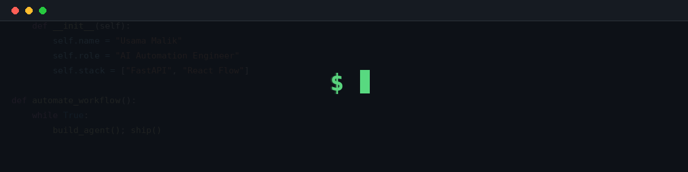

  

  

  

  
  
  

  

  

### 👨‍💻 About Me

- 🔭 Currently building **AI agent platforms & workflow automation tools**
- 🌱 Currently exploring **React Flow & FastAPI**
- 💬 Ask me about **AI Agents, Python, FastAPI, React & Workflow Automation**
- 📫 Reach me at **usama.malik100@gmail.com**
- ⚡ Fun fact: **I automate things so I have more time to automate more things**

### 🛠️ Languages & Tools

  
  
  
  
  
  
  
  
  
  
  
  
  
  
  

### 📊 GitHub Stats

  
  

  

<h3 align="center">🔗 Connect with me</h3>

  
  
  

  

